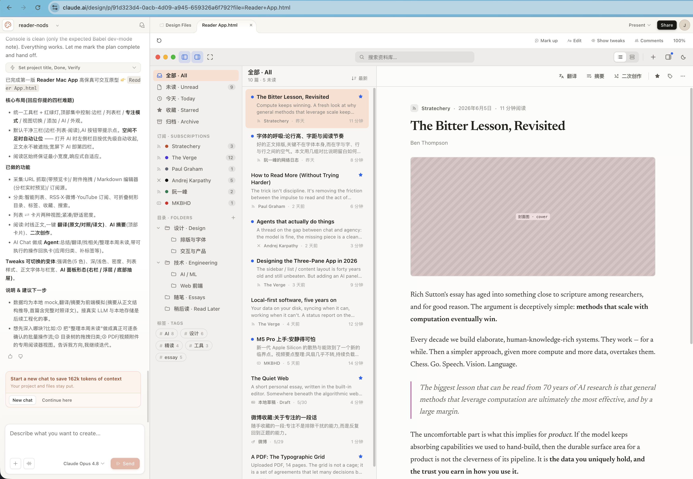

# baoyu-design

**Run Claude Design on your own local agent — Cursor, Claude Code, Claude Desktop, or any file‑capable coding agent.**

[English](README.md) · [简体中文](README.zh-CN.md) · [Changelog](CHANGELOG.md)

  

`baoyu-design` packages **Claude Design** — the design engine behind [claude.ai/design](https://claude.ai/design) — as a portable **Agent Skill**. Drop it into a local agent and you get most of what the website does, right inside your editor: polished UI mockups, interactive prototypes, wireframes, landing pages, dashboards, mobile apps, and slide decks — all produced as self‑contained HTML.

No website, no separate subscription, no upload step. The agent already on your machine does the work, and every artifact stays in your repo.

---

## Screenshots

The same Reader Mac App prompt was used in Cursor, Codex, Claude, and Claude Design.

| Cursor | Codex | Claude | Claude Design |
|---|---|---|---|
|  |  |  |  |

<details>
<summary>Prompt used for all screenshots</summary>

```markdown
Build a Reader Mac app that helps me read and save articles better. All data is stored locally.

## Information collection

1. Manual adding
Support manually adding different types of information:
- URL: enter a URL and automatically fetch content and images
- Attachments: upload PDFs, videos, and images
- Markdown editing: like publishing a blog post, enter the title, body, and cover image
- Other

2. Automatic subscriptions
- RSS feeds
- Social media accounts: X, Weibo, YouTube
- Other

## Editing and organization

1. Tags
Every item can have tags.

2. Categories and folders
Create tree-structured folders and place content in different categories.

3. Favorites
Users can click to favorite an item.

4. Editing
Every item can be edited with a built-in Markdown editor.

## AI assistance

1. Automatic translation
Support translation across different languages.

2. Summaries and abstracts
Generate summaries for captured content.

3. Derivative creation
Create new work based on one or more pieces of content.

4. Integrated AI Chat
Use AI Chat to call AI Agents that help process content.
```

</details>

---

## Why run it locally

- **Free yourself from the website.** You get the vast majority of `claude.ai/design`'s capabilities without ever leaving your editor — same methodology, same craft standards, same output format.
- **Best with Opus 4.8.** The skill is a long, demanding design brief; the stronger the model, the better the result. Pair it with **Claude Opus 4.8** for the best output, and it still works well on other capable models.
- **Iterate by pointing, not describing.** Because the deliverable is plain HTML served on `localhost`, you can lean on your agent's built‑in browser preview and element‑annotation tools (Cursor Browser / DevTools, Claude Preview, or Codex Browser). Point at a button in the live preview, say what you want changed, and the agent edits the underlying source — a tight, visual second‑pass editing loop that's hard to get on a website.
- **Everything is yours.** Output lands in `designs/<project>/` as self‑contained HTML you can version, fork, export, or ship.

---

## What it can make

The skill drives a full design process — clarifying questions → gathering design context → producing one or more HTML deliverables → previewing and verifying. It ships **24 built‑in skills** and a set of ready‑made component scaffolds.

| Area | Built‑in skills |
|---|---|
| **Core design** | Hi‑fi design · Interactive prototype · Wireframe · Frontend aesthetic direction |
| **Decks** | Make a deck · Speaker notes |
| **Mobile & motion** | Mobile prototype · Animated video · Sound effects |
| **Design systems** | Create design system · Design Components (`.dc.html`) · Make tweakable |
| **Export & handoff** | Standalone HTML · PDF · PPTX (editable) · PPTX (screenshots) · Send to Figma · Send to Canva · Handoff to Claude Code |
| **AI assets & integration** | Gemini image generation · Call Claude from prototypes · Read PDF |

**Starter components** (in [`starter-components/`](skills/baoyu-design/starter-components/)) save the agent from hand‑rolling the basics: iOS / Android / macOS / browser frames, a pan‑zoom design canvas, a slide‑deck stage, a timeline animation engine, a tweaks panel, and a fillable image slot.

---

## How it works

The skill is plain Markdown plus a few JSX/JS scaffolds — no build step, no runtime.

```
skills/baoyu-design/
├── SKILL.md              # Entry point — orchestrates the whole flow
├── system-prompt.md      # The design methodology & craft standards (source of truth)
├── references/
│   ├── claude.md         # Tool map for Claude Code
│   ├── cursor.md         # Tool map for Cursor
│   └── codex.md          # Tool map for Codex Agent
├── built-in-skills/      # 24 specialized prompts (decks, mobile, export, …)
└── starter-components/   # Device frames, deck stage, canvas, animation engine, …
```

When you ask for a design, the agent reads `SKILL.md`, loads the core methodology from `system-prompt.md`, detects whether it's running in Cursor, Claude Code, Codex Agent, or a generic file‑capable harness, and reads the matching reference doc when one exists. It then pulls in only the built‑in skill(s) the task needs. The split keeps craft rules harness‑independent while each environment resolves its own tools for *asking questions*, *previewing*, *screenshotting*, and *verifying*.

---

## Quick start

### Prerequisites

- A local agent — **[Cursor](https://cursor.com)**, **[Claude Code](https://claude.com/claude-code)**, **[Codex](https://developers.openai.com/codex/)**, or any of the 70+ agents the installer supports (Cline, Roo Code, GitHub Copilot…). Cursor, Claude Code, and Codex have first‑class tool references inside the skill.
- **Claude Opus 4.8** selected as the model, for best results.
- **Node.js** (to run the `npx` installer below). **Python 3** is also handy for the local preview server.

### Install

**Recommended — the `skills` CLI.** [`npx skills`](https://github.com/vercel-labs/skills) (from Vercel Labs) reads this repo, finds `skills/baoyu-design/`, and drops it into the right folder for whatever agent it detects:

```bash
# Install into the current project (auto‑detects your agent)
npx skills add JimLiu/baoyu-design

# …or install globally, for every project
npx skills add JimLiu/baoyu-design -g

# Target a specific agent explicitly
npx skills add JimLiu/baoyu-design --agent claude-code
npx skills add JimLiu/baoyu-design --agent cursor
npx skills add JimLiu/baoyu-design --agent codex

# Just list what's in the repo first
npx skills add JimLiu/baoyu-design --list
```

It installs to `.claude/skills/` for Claude Code and `.agents/skills/` for Cursor/Codex-style agents (add `-g` for the `~/`‑level user install).

**Alternative — hand the repo URL to your agent.** Don't want to install anything? Paste the URL into chat and let the agent fetch the skill itself:

> Read https://github.com/JimLiu/baoyu-design and follow its `skills/baoyu-design/SKILL.md` to design a settings screen for a meditation app.

The agent clones or fetches the repo, loads `SKILL.md`, and proceeds — perfect for a one‑off.

### Use it

Once the skill is installed (or fetched), just describe a design task in plain language — it auto‑activates from its description:

> Design 3 hi‑fi variations of a settings screen for a meditation app.

In Claude Code you can also trigger it explicitly with `/baoyu-design`; in Codex, mention `$baoyu-design` when skills are available. The agent asks a few clarifying questions, builds the HTML under `designs/`, and previews it over `localhost`. **Point at any element in the live preview and say what to change** — the agent edits the underlying source for a fast, visual second pass.

### Preview server

Deliverables are previewed over HTTP (multi‑file prototypes won't load from `file://`). The agent normally starts this for you; to run it by hand:

```bash
python3 -m http.server 4311 --directory designs
# then open http://localhost:4311/<project>/<file>.html
```

---

## Example prompts

- *"Design 3 hi‑fi variations of a pricing page using the brand in this screenshot."*
- *"Prototype a working onboarding flow — real state, transitions, form validation."*
- *"Make a 10‑slide deck from this PRD for an engineering all‑hands."*
- *"Wireframe a few layout ideas for a mobile expense‑tracker home screen."*
- *"Recreate the composer UI from this codebase, then export it as standalone HTML."*

For best results, **give it design context** — a screenshot, a UI kit, a Figma link, or a codebase. Starting from real context is the single biggest lever on quality; the skill will ask for it if you don't provide it.

---

## Credits & license

This project repackages **Claude Design**, the design skill by **Anthropic** that powers [claude.ai/design](https://claude.ai/design), so it can run on local agents. It is an independent, community effort and is not affiliated with or endorsed by Anthropic.

Repackaged and maintained by **Jim Liu 宝玉**. Released under the [MIT License](LICENSE).
